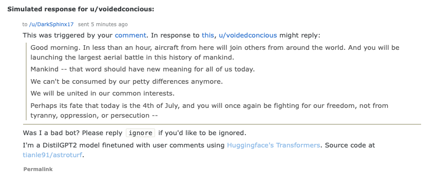

# Astroturf
Are you...
- Curious how users might respond to a submission or comment?
- Don't want to wait for a response?
- Want a shitty bot to talk to?

Look no further!

Bot responds to mentions of reddit users in comments.
Currently only monitors [r/AskReddit](https://www.reddit.com/r/AskReddit).




# Architecture
Works locally like so:


# Deploy
You'll need a `praw.ini`. 
By default it looks for `praw.ini` and finds credentials under `[astroturf_bot]`.
It looks something like the following (get your own keys [here](https://www.reddit.com/prefs/apps)):
```ini
[astroturf_bot]
client_id=???
client_secret=???
password=???
user_agent=???
username=???
```

Steps:
1. Build the image. `docker build -t astroturf .`
2. Deploy. `docker-compose up`
