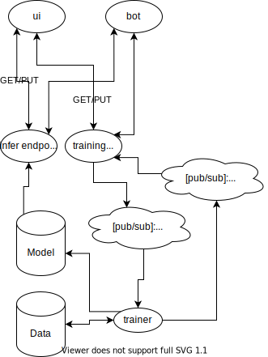

# Astroturf
To be updated.

## Architecture

## Ops

`gsutil cp pathConfig.json gs://astroturf-dev-configs/pathConfig.json`
`gsutil cp astroturf-praw.ini gs://astroturf-dev-configs/astroturf-praw.ini`

# Reddit bot
Description
- Responds to “what would u/xxx say”.
- While loop for streaming by new. Submits request for user and link, waits for response.
- Move retrain request into api

Endpoint to-do
- Query for untrained users.
- Query for trained users with option to refresh.
- Waiting for retraining.

Proposal
- Merge scraper and trainer together, put behind a new trainer endpoint.
- Option to limit to most recent `n` comments.
