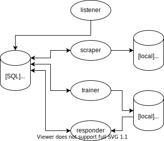

# Astroturf
To be updated.

## Architecture

## Ops

`gsutil cp pathConfig.json gs://astroturf-dev-configs/pathConfig.json`
`gsutil cp astroturf-praw.ini gs://astroturf-dev-configs/astroturf-praw.ini`
`export imagepath=tianlechen/astroturf && docker build -f Dockerfile -t $imagepath . && docker push $imagepath`
`export imagepath=tianlechen/astroturf:gpu && docker build -f Dockerfile.gpu -t $imagepath . && docker push $imagepath`
